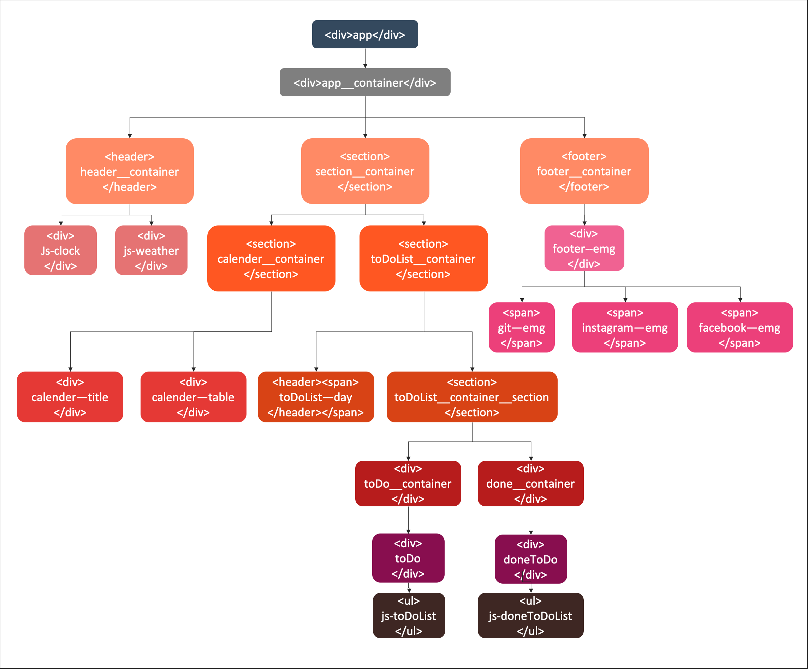

# Calender-ToDoList 바닐라JS로 만들기

바닐라 자바스크립트로 Calender ToDo 구현하기
[https://intae92.github.io/Calender-ToDoList/toDoList/index.html](https://intae92.github.io/Calender-ToDoList/toDoList/index.html)

---

순수한 HTML, CSS, JavaScript, DOM API를 활용하여 달력 투두리스트를 만들었습니다.


---

## 구현 과정

> 자바스크립트로 Calender ToDo를 만들기 위해 DOM의 구조와 조작방법에 대한 이해가 필요했으며 특히 달력을 구현하기 위해 Date 객체에 대한 사용법을 알게 되었습니다.

다음과 같은 내용을 설명하겠습니다.
(함수는 특정 부분만 설명하겠습니다.)

- 마크업(Markup) 작업
- 자바스크립트 구현 함수

  - Date 객체
  - 기능 구현
    - Date 객체로 해당 날짜 및 월별 달력 구현
    - 달력 자동 구현
    - 날짜 별로 ToDo, Done 리스트 저장 및 출력
    - 달력에 날짜 별로 ToDo, Done 갯수 출력
    - 날짜 클릭 및 다른 월로 이동하는 버튼 클릭시
      - ToDo, Done 리스트 리셋
      - 해당 날짜 ToDo, Done 리스트 출력
    - 시간 구현
    - 현재 위치의 날씨 출력

- CSS 작업
- 끝으로...

---

## 마크업 작업



---

## 자바스크립트 구현 함수

### Date 객체, 해당 날짜 구하기

달력 부분을 만들기 위한 controller 이며 paintTable() 함수에서 오늘 및 해당 날짜의 년,월,일을 계산해서 달력을 만드는 paintCalenderTable()함수로 인자값을 넘겨준다.
전역 변수로 현재 년,월,일 및 달력에서 특정 날짜를 클릭하면 특정 날짜의 참조값을 자동으로 바뀌게 하기 위해 선언해 두었습니다.

```javascript
//calender.js

let thisYear, thisMonth, thisDay, targetDay;

const paintTable = (year, month) => {
  const today = new Date();
  thisYear = year || today.getFullYear();
  thisMonth = month || today.getMonth();
  paintCalenderTable(thisYear, thisMonth); //달력 만드는 함수
  turn_over_the_calender(); //달력 넘기기
};
```

---

### 달력 구현

달력을 6행으로 만들어 지난달, 현재 달, 다음달 까지 실제 달력 처럼 구현했습니다.
달력 화면상 지난달, 현재달, 다음달을 구분 하기위해 classList에 각각 "td-lastMonth", "td-thisMonth", "td-nextMonth"를 추가 하여 구분 하였습니다.
달력안의 날짜, 해당 날짜의 todo, done 갯수 등 화면상 나오는 모든 부분은 paintCalenderTable()함수가 구현합니다. 또한 현재 구현 하는 날짜의 년도 값과 월 값을 전역변수에 초기화했습니다(달력 월을 넘겼을때 값으로 사용하기 위함)

```javascript
//calender.js

const paintCalenderTable = (year, month, title) => {
  // console.log("paintCalenderTable year month", year, month);
  // const dayName = ["일", "월", "화", "수", "목", "금", "토"];
  const dayName = ["SUN", "MON", "TUE", "WED", "THU", "FRI", "SAT"];
  const calenderCellCount = 42;
  const today = new Date();
  const today_year = today.getFullYear();
  const today_month = today.getMonth() + 1;
  const today_day = today.getDate();
  thisDay = today_day; //오늘 몇일

  days = []; //지정된 월의 달력 페이지에 출력될 날짜
  daysTable = []; //달력을 만들기 위한 table에 맞춘 날짜 데이터 set
  thisYear = year;
  thisMonth = month;

  paintTitle(thisYear, thisMonth + 1); //달력 년, 월 텍스트로 보이게
  paintToDoListDay(thisDay); //투두리스트 지정된 날짜 text 출력

  //저번달 마지막날
  const lastMonthLastDate = new Date(year, month, 0);
  const lastMOnthLastDate_year = lastMonthLastDate.getFullYear();
  const lastMOnthLastDate_month = lastMonthLastDate.getMonth() + 1;
  const lastMonthLastDate_date = lastMonthLastDate.getDate();
  const lastMonthLastDate_day = lastMonthLastDate.getDay();

  //이번달 첫날
  const thisMonthFirstDate = new Date(year, month);
  const thisMonthFirstDate_year = thisMonthFirstDate.getFullYear();
  const thisMonthFirstDate_month = thisMonthFirstDate.getMonth() + 1;
  const thisMonthFirstDate_date = thisMonthFirstDate.getDate();
  const thisMonthFirstDate_day = thisMonthFirstDate.getDay();

  //이번달 마지막날
  const thisMonthLastDate = new Date(year, month + 1, 0);
  const thisMonthLastDate_year = thisMonthLastDate.getFullYear();
  const thisMonthLastDate_month = thisMonthLastDate.getMonth() + 1;
  const thisMonthLastDate_date = thisMonthLastDate.getDate();
  const thisMonthLastDate_day = thisMonthLastDate.getDay();
  //   console.log(thisMonthLastDate_day);

  //다음달
  const nextMonthDate = new Date(year, month + 1);
  const nextMonthDate_year = nextMonthDate.getFullYear();
  const nextMonthDate_month = nextMonthDate.getMonth() + 1;

  const calenderStartNumber =
    lastMonthLastDate_date - thisMonthFirstDate_day + 1;
  const calenderLastNumber =
    calenderCellCount -
    (lastMonthLastDate_date - calenderStartNumber + 1 + thisMonthLastDate_date);

  //저번달
  for (let i = calenderStartNumber; i <= lastMonthLastDate_date; i++) {
    let daysId = `${lastMOnthLastDate_year}${
      lastMOnthLastDate_month < 10
        ? `0${lastMOnthLastDate_month}`
        : lastMOnthLastDate_month
    }${i < 10 ? `0${i}` : i}_${i}_td-lastMonth`;
    days.push(daysId);
  }

  //이번달
  for (let i = thisMonthFirstDate_date; i <= thisMonthLastDate_date; i++) {
    let daysId = `${thisMonthFirstDate_year}${
      thisMonthFirstDate_month < 10
        ? `0${thisMonthFirstDate_month}`
        : thisMonthFirstDate_month
    }${i < 10 ? `0${i}` : i}_${i}_td-thisMonth`;
    days.push(daysId);
  }

  //다음달
  for (let i = 1; i <= calenderLastNumber; i++) {
    let daysId = `${nextMonthDate_year}${
      nextMonthDate_month < 10 ? `0${nextMonthDate_month}` : nextMonthDate_month
    }${i < 10 ? `0${i}` : i}_${i}_td-nextMonth`;
    days.push(daysId);
  }

  //table 형식의 날짜 데이터 만들기
  let rowArr = [];
  for (let i = 0; i < days.length; i++) {
    rowArr.push(days[i]);
    if (rowArr.length === 7) {
      daysTable.push(rowArr);
      rowArr = [];
    }
  }
  //달력 안에 일마다 todo 카운트
  const todoDivCount = (span, id) => {
    let currentToDoList = localStorage.getItem(TODO_LS);
    if (currentToDoList !== null) {
      let count = 0;
      const todosList = JSON.parse(currentToDoList);
      count = todosList.filter((v) => v.date === id).length;
      if (count !== 0) span.innerText = `To-Do:${count}`;
      span.classList.add("todoCount");
    }
  };
  //달력 안에 일마다 done 갯수 세기
  const doneDivCount = (span, id) => {
    let currentDoneList = localStorage.getItem(DONE_LS);
    if (currentDoneList !== null) {
      let count = 0;
      const doneList = JSON.parse(currentDoneList);
      count = doneList.filter((v) => v.date === id).length;
      if (count !== 0) span.innerText = `Done:${count}`;
      span.classList.add("doneCount");
    }
  };

  //table 만들기
  for (let row = 0; row < 6; row++) {
    let tr = document.createElement("tr");
    for (let col = 0; col < 7; col++) {
      let date = daysTable[row][col].split("_");

      let td = document.createElement("td");
      let dateDiv = document.createElement("div");
      let todoDiv = document.createElement("div");
      let doneDiv = document.createElement("div");
      let dateSpan = document.createElement("span");
      let todoDivSpan = document.createElement("span");
      let doneDivSpan = document.createElement("span");

      dateDiv.classList.add("table-td-dateDiv");
      todoDiv.classList.add("table-td-todoDiv");
      doneDiv.classList.add("table-td-doneDiv");

      if (col === 0) dateDiv.classList.add("sat--redcolor");
      todoDiv.appendChild(todoDivSpan);
      doneDiv.appendChild(doneDivSpan);

      //달력 칸안에 월 표기
      if (date[1] === "1") {
        let oneDayTitle = new Date(
          date[0].slice(0, 4),
          date[0].slice(4, 6),
          1,
          1,
          00,
          00,
          00
        );
        dateSpan.innerText = `${
          oneDayTitle.getMonth() < 1 ? 12 : oneDayTitle.getMonth()
        }월 1일`;
      } else {
        dateSpan.innerText = `${date[1]}`;
      }

      //오늘 날짜 색으로 표시하기
      if (
        date[0] ===
        `${today_year}${today_month < 10 ? `0${today_month}` : today_month}${
          today_day < 10 ? `0${today_day}` : today_day
        }`
      ) {
        dateSpan.classList.add("today--day");
      }
      dateDiv.appendChild(dateSpan);
      td.append(dateDiv, todoDiv, doneDiv);
      td.id = date[0];
      td.classList.add(date[2]);
      tr.appendChild(td);

      todoDivCount(todoDivSpan, date[0]); //달력 안에 todo 갯수 세기
      doneDivCount(doneDivSpan, date[0]); //달력 안에 done 갯수 세기
    }
    tbody.appendChild(tr);
  }
};
```

---

### 리스트 값 추가

투두 리스트에 값을 입력하면 form 이벤트 리스너로 input에 값을 전달 받아 todo리스트를 구현하기 위해 paintToDo()함수에 인자값을 넘깁니다.

```javascript
//todo.js

const handleToDoSubmit = (e) => {
  e.preventDefault();
  isDayClick = true;
  const currentValue = toDoInput.value;
  paintToDo(currentValue);
  toDoInput.value = "";
};
```

---

### todo 리스트 구현

paintToDo 함수는 input태그로 전달된 text 값과, 리스트에 구현될 리스트의 id 값, 리스트의 해당 날짜 값, 다른 날짜 클릭스 중복 저장을 막기위한 boolean값이 인자값으로 넘어 옵니다.

맨 처음 텍스트 값만 인자값으로 전달 받으면 Date.now() 메소드로 id 값을 초기화 하고 객체를 선언해서 toDos 전역변수에 추가 합니다. toDos, doneToDos 전역 변수는 localStorage에 투두 리스트의 값들을 저장하기 위한 배열 입니다.

```javascript
//todo.js

let toDos = [];
let doneToDos = [];

//todo list 에 있는 값과 달력에 있는 값 맞추기
const paintToDo = (text, originalId, day, isDayClickValue) => {
  isDayClick = isDayClickValue || isDayClick;
  const li = document.createElement("li");
  const delBtn = document.createElement("button");
  const doneBtn = document.createElement("button");
  const span = document.createElement("span");

  let toDoId;
  if (originalId !== undefined) {
    toDoId = originalId;
  } else {
    toDoId = Date.now();
  }

  li.id = toDoId;
  span.innerText = text;
  // delBtn.innerText = "❌";
  delBtn.classList.add("delBtn");

  delBtn.addEventListener("click", deleteToDo);
  // doneBtn.innerText = "✅";

  doneBtn.classList.add("doneBtn");

  doneBtn.addEventListener("click", deleteToDo);

  const toDosObj = {
    text,
    id: toDoId,
    date: day || targetDay__toDoId,
  };

  li.append(span, delBtn, doneBtn);
  if (toDosObj["date"] === targetDay__toDoId) toDoList.appendChild(li);

  if (isDayClick) {
    toDos.push(toDosObj);
    saveToDo();
  }
};
```

---

### 시간 구현

setInerval()내장함수로 1초마다 Date 객체의 메소드로 해당 시간을 구해서 출력 했습니다.

```javascript
//clock.js
const clock = document.querySelector(".js-clock");

const getTime = () => {
  const date = new Date();
  const hours = date.getHours();
  const minutes = date.getMinutes();
  const seconds = date.getSeconds();

  clock.innerText = `${hours < 10 ? `0${hours}` : hours}:${
    minutes < 10 ? `0${minutes}` : minutes
  }:${seconds < 10 ? `0${seconds}` : seconds}`;
};

const clockInit = () => {
  getTime();
  setInterval(getTime, 1000);
};
clockInit();
```

---

### 날씨 구현

openweathermap 사이트에서 제공하는 API를 활용하여 현재 위치의 온도를 구했습니다.

```javascript
const getWeather = (lat, lng) => {
  fetch(
    `https://api.openweathermap.org/data/2.5/weather?lat=${lat}&lon=${lng}&appid=${API_KEY}&units=metric`
  )
    .then((response) => {
      return response.json();
    })
    .then((json) => {
      const temperature = json.main.temp;
      const place = json.name;
      weather.innerText = `${temperature} @ ${place}`;
    });
};
```

---

### CSS

CSS의 가상요소와 Font Awesome을 활용하여 리스트의 버튼에 적용시켰습니다.

```css
.delBtn::before {
  content: "\f00d";
  font-family: "Font Awesome 5 Free";
  font-weight: 900;
  margin-left: 10px;
  color: red;
}
.doneBtn::before {
  content: "\f058";
  font-family: "Font Awesome 5 Free";
  font-weight: 900;
  margin-left: 10px;
  color: green;
}
```

---

## 끝으로...

처음 계획 했던 기능으로 Calender-ToDo리스트를 구현 했지만 그 과정에서 함수는 하나의 기능을 구현하기 위해 기능을 분할 시키고자 했지만 생각과는 다르게 중복되는 소스코드도 많고 순서가 엉망진창으로 얽혀 추후 리팩토링을 통해 다시 기능을 나눠 봐야 겠다
또한 나중에는 node.js와 electron을 활용하여 데스크탑 앱을 만들어 봐야곘다.
